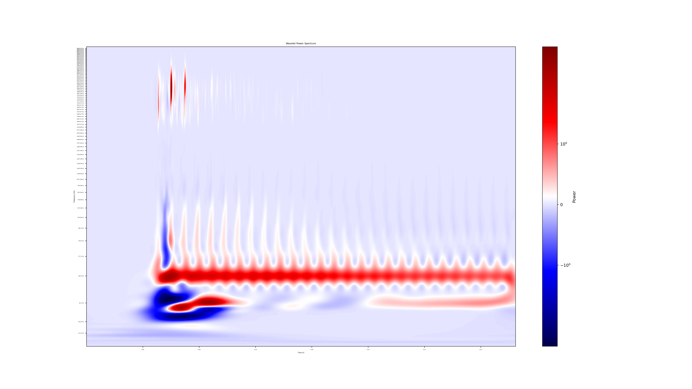

# wavelet-tone-analysis
## Installation instructions
Dependencies can be installed via pip:
```
pip install -r requirements.txt
```

## Running the program
`main.py` performs preprocessing and generates a .png file representing the wavelet power spectrum difference between the recordings of two notes of the same pitch.

Running `main.py` will perform the following:
1. Normalize the volumes of the two tracks, normalizing the louder track to match the Loudness Units Full Scale (LUFS) of the quieter track.
2. Aligns the two tracks so that the notes begin at the same time.
3. Truncates the longer track to match the length of the shorter track.
4. Computes the wavelet power spectrum of the two tracks.
5. Computes the difference between the two spectrums.
6. Saves a .png representation of the difference between the two spectrums.

The .png can be used to identify frequency ranges that need to be adjusted to match the tone of the desired track. Here is an example of what one could look like:

